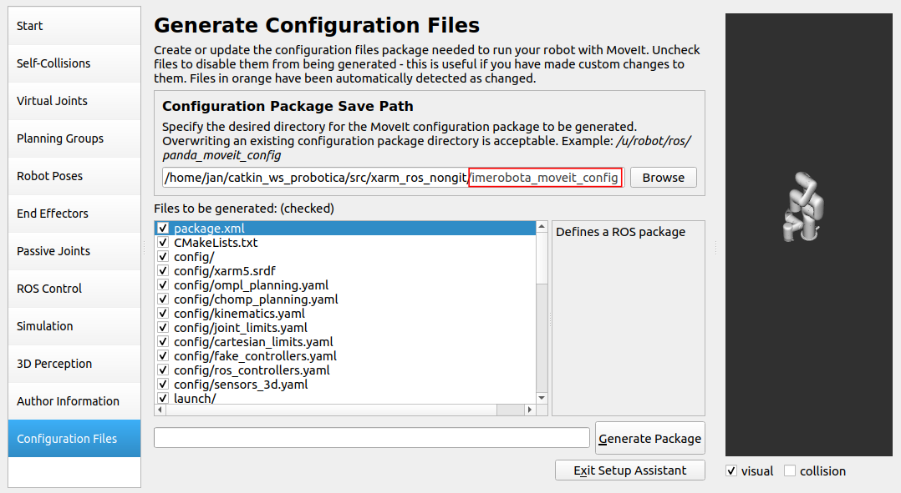

# Uvod
&ensp;&ensp;	U nastavku ReadMe slijedi detaljan opis kako iz postojećeg xarm_description napraviti svoju simulaciju modela robotske ruke u Gazebu i Rvizu kako bi se mogli isprobavati različiti kontroleri. Istim postupkom moguće je napraviti simulaciju u Gazebu i kinematičli model pomoću Moveit-a za bilo koju ruku. U slučaju nedostatka URDF datoteke robota moguće ju je generirati uz pomoć SOLIDWORKS paketa 

## Izrada moveit_configure datoteke

	$  roslaunch moveit_setup_assistant setup_assistant.launch
	
&ensp;&ensp;	Nakon pokretanja moveit asistenta potrebno je odabrati URDF datoteku robotske ruke.
	

	

&ensp;&ensp;	Poslije učuitavanja modela potrebno je definirati Self-Collisins. Ovdje je potrebno stisnuti na gumb ***Generate Collisions Matrix***

&ensp;&ensp;	U Planning groupu potrebno je definirati kinematički algoritam za rješavanje pozicije svih zglobova u prostoru. Najčešće korišteni algoritam je ***kdl_kinematics_plugin/KDLKinematicsPlugin***. 

&ensp;&ensp;	Zadnji korak koji je potreban unutar Planning Groups-a je definiranje svih Jointova unutar kinematičkog modela. U slučaju da se unutar robotske ruke nalazi i hvataljka potrebno je napraviti zasebni kinematički model za nju unutar Planning Groupsa te se za nju ne specificira Kinematic Solver.

&ensp;&ensp;	Unutar Robot Poses moguće je isprobati ispravnost pokretanja svih zglobova i spremiti glavne pozicije robota u kojima bi se on mogao nalaziti. U ovom slučaju spremljena je njegova početna pozicija. Treba stisnuti na gumb ***Add Pose***

&ensp;&ensp;	Unutar End Effectors-a definira se zadnji zglob na robotu. U ovom slučaju ne koristi se hvataljka te je njegov zadnji zglob joint5 unutar kinematičkog modela arm_controller.

&ensp;&ensp;	Unutar ROS Controla potrebno je definirati željeni kontroller pomoću ***Add Controller*** ili ***Auto Add Follow Joints Trajectory Controllers For Each Planning Groups***. Moguće je odabrati između više različitih vrsta controllera te je u ovom slučaju odabran pomoću ***Add Controller*** naredbe position_controllers/JointTrajectoryController. Te je na slici ispod moguće vidjeti kako se definira kontroler.

&ensp;&ensp;	Potrebno je definirati podatke autora. Zadnji dio generiranja robot_moveit_config paketa je odabrati gdje će datoteka biti spremljena i što sve želimo definirati. Ispravna nomenklatura za generiranje paketa je ***imerobota_moveit_conig***. 

## Izmjena moveit_configure datoteke

&ensp;&ensp;	Prva datoteka koju je potrebno izmjeniti kako bismo mogli spojiti Rviz i Gazebo pomoću kontrolera je ***config/ros_controllers.yaml*** datoteka. U datoteci je potrebno dodati dodatni namespace kako bi stvar mogla raditi i potrebno je dodati listu kontrolera kako bi Rviz mogao prepoznati prilikom pokretanja kontrolere koji su upogonjeni u Gazebu. Na slici ispod prikazano je što je sve potrebno dodati i gdje.

&ensp;&ensp;	Za pokretanje Rviz-a odabrano je izmjeniti datoteku ***launch/demo.launch***. Potrebno je definirati ispravni namespace gdje se publishaju joint_statovi te je potrebno promjeniti fake_execution u false.

 
 
&ensp;&ensp;	Nakon što smo stavili ***fake_execution*** u false, demo.launch neće raditi te je potrebno izmjeniti datoteku ***launch/trajectory_execution.launch.xml***. 

 
 
&ensp;&ensp;	Za pokretanje Gazeba iz generirane datoteke moveit-a odabran je gazebo.launch gdje je potrebno podesiti pravilno pozivanje urdf datoteke robota zbog toga što moveit generira krivu putanju. Crvenom bojom su označene izbrisani dijelovi koda, a plavom dodani novi dijelovi.
 
  
  
&ensp;&ensp;	Kako bismo mogli pokrenuti kontroler u Gazebu potrebno je izmjeniti ***launch/ros_controllers.launch*** datoteku jer u njoj nisu definirani dobro namespacovi i svi potrebni kontroleri za rad simulacije. Na slici ispod prikazan je izmjenjeni oblik datoteke.

  
  
  
  
  
 

